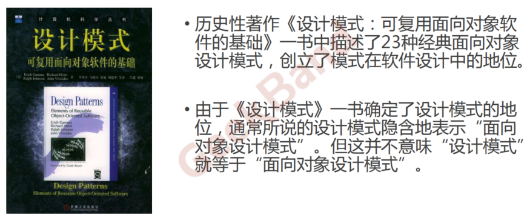
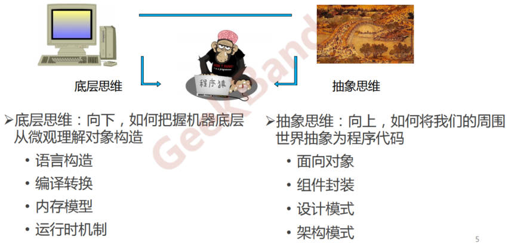
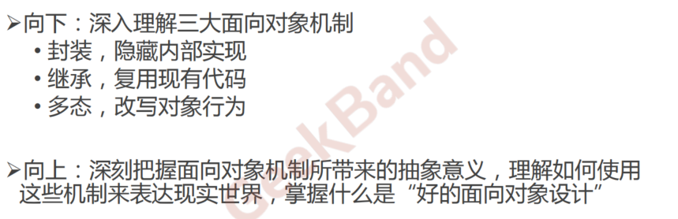
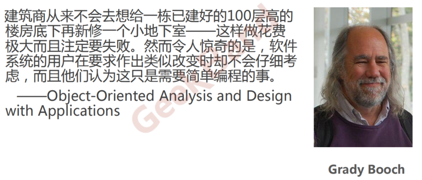
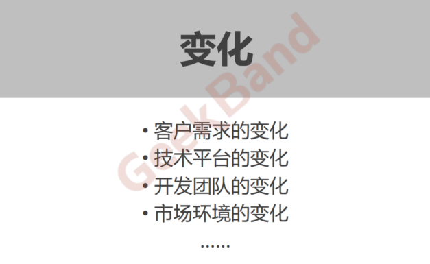
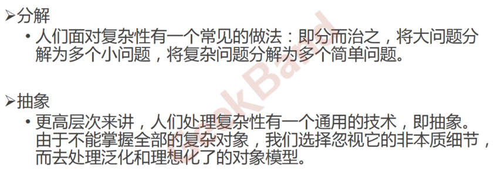
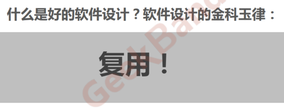

<!--
 * @Author: gl401387338@gmail.com gl5644838
 * @Date: 2023-07-29 16:30:43
 * @LastEditors: gl401387338@gmail.com gl5644838
 * @LastEditTime: 2023-07-29 17:28:57
 * @FilePath: \designMode\learningNotes\1.概述.md
 * @Description: 
 * 
 * Copyright (c) 2023 by 毛利的野望, All Rights Reserved. 
-->
> 前言：
> 设计模式的课呢，主要是跟着GeekBand的设计模式课程的，每一节课我会稍微做一点笔记，当然主要以截图或者复制的形式（比较偷懒）。欧克，下面就开始吧。
## 概述

### 1.课程目标
* 理解松耦合设计思想
* 掌握面向对象设计原则
* 掌握重构技法改善设计
* 掌握GOF核心设计模式
  
### 2.什么是设计模式
“每一个模式描述了一个在我们周围不断重复发生的问题，以及该问题的解决方案的核心。这样，你就能一次又一次地使用该方案而不必做重复劳动”。
——Christopher Alexander

### 3.GOF设计模式

### 4.从面向对象谈起
<u>什么是底层思维，什么是抽象思维</u>

### 5.深入理解面向对象
<u>对于底层思维和抽象思维，程序员该如何建立两者的联系</u>

### 6.软件设计固有的复杂性

### 7.软件设计复杂的根本原因
<u>变化。。。</u>

### ==8.如何解决复杂性？==
<u>该如何解决软件的复杂性呢？两种思路：1.分解。2.抽象。
==分解==： 分而治之。面相结构编程的主要写法。（普通人的思维方式一般也是分解）

==抽象==： 泛化、理想化对象模型，就是用现有的抽象的模式，来套在对象上。再具体一点感觉像是，将上层的高级对象，的泛化基本的特征抽离抽象出来，然后再根据这些泛化基本的特征进行发散联想，联想到其他现有的、完善的、规范的上层对象上，从而学习该对象的模式，套用其框架从而简化设计流程。（确实挺抽象的。。不过貌似在影视中不少大佬都会有如此的思维方式，这也是面向对象编程的主要写法思路）</u>

### 9.软件设计的目标
<u>复用复用复用！</u>
