<!--
 * @Author: gl401387338@gmail.com gl5644838
 * @Date: 2023-07-29 17:25:38
 * @LastEditors: gl401387338@gmail.com gl5644838
 * @LastEditTime: 2023-07-29 17:54:52
 * @FilePath: \designMode\learningNotes\2.面向对象设计原则.md
 * @Description: 
 * 
 * Copyright (c) 2023 by 毛利的野望, All Rights Reserved. 
-->
 ## 面向对象设计原则

 ### 1.面向对象设计，为什么？
<u>==抵御变化！==</u>

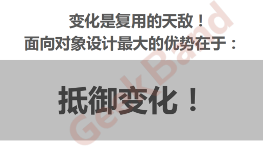

### ==2.重新认识面向对象==
<u>==隔离变化==：应该就是将经常发生变化的抽象出来，或者说成一个类，然后进行维护，从而保证变化对整个架构的影响降到最低。
==各司其职==：照各司其职的思路，来将每一类事务抽象成一个类，然后再对每个类进行维护。想要能够轻易地隔离变化，必须要将变化单独抽象成一个类。所以发现有个关键点就是，要根据整个软件需求进行思考，然后发觉其中变化最多的一类事务，将其抽象出来。这时如何抽象就可以借鉴现有的设计模式了。</u>

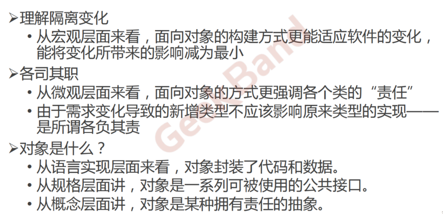

### 3.面向对象设计原则（1）
<u>依赖倒置原则（DIP，Dependency Inversion Principle）</u>

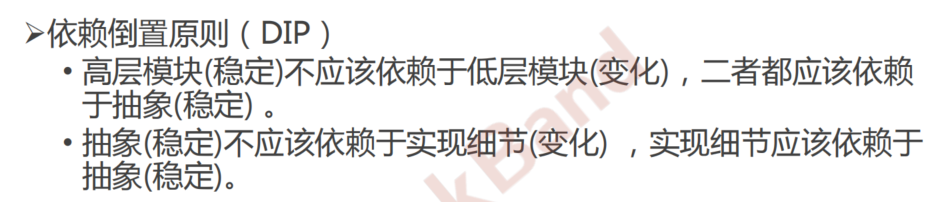

### 4.面向对象设计原则（2）
<u>开放封闭原则（OCP，Opened Close Principle）</u>

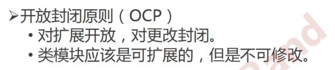

### 5.面向对象设计原则（3）
<u>单一职责原则（SRP，Single Responsibility Principle）</u>

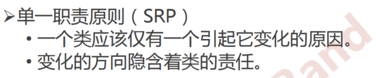

### 6.面向对象设计原则（4）
<u>Liskov替换原则/里氏替换原则（LSP，Liskov Substitution Principle）</u>

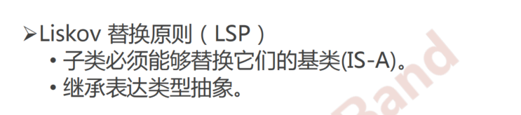

### 7.面向对象设计原则（5）
<u>接口隔离原则（ISP，Interface Segregation Principle）</u>

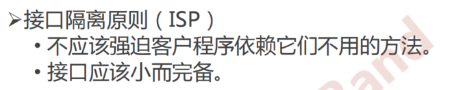

### 8.面向对象设计原则（6）
<u>优先使用对象组合，而不是类继承</u>

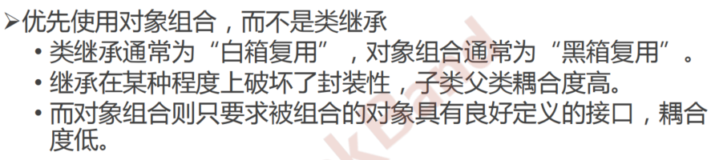

### 9.面向对象设计原则（7）
<u>封装变化点</u>

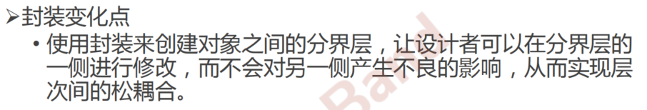

### 10.面向对象设计原则（8）
<u>针对接口编程，而不是针对实现编程</u>

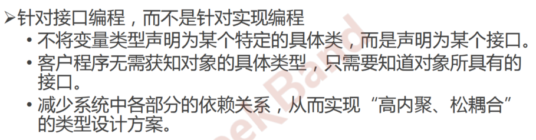

### 11.面向接口设计
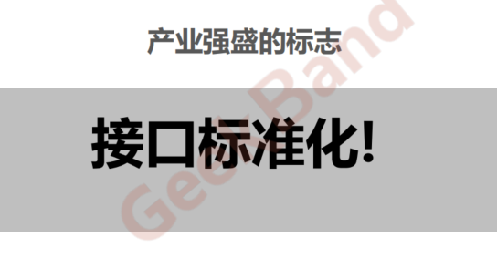

### 12.以史为鉴
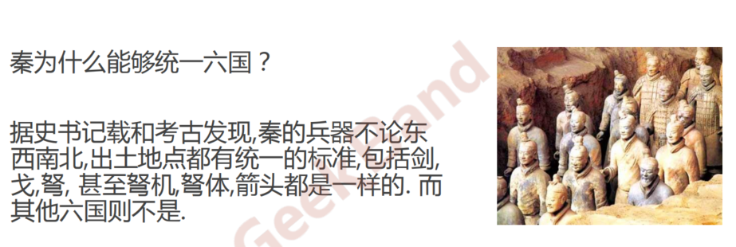
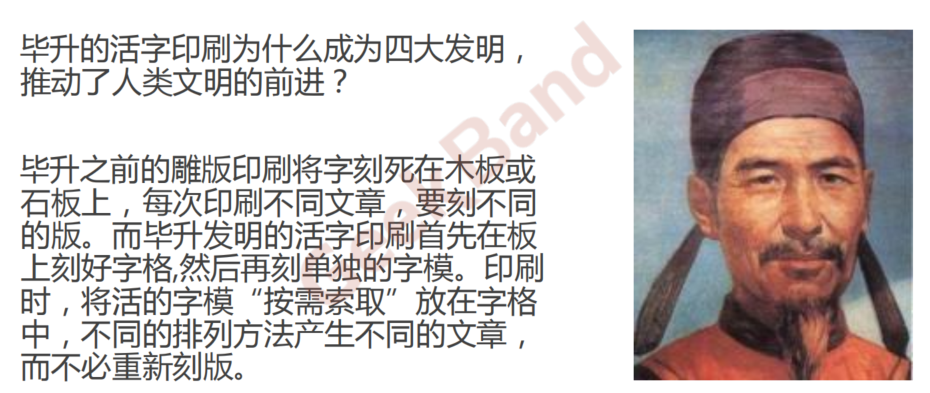

### 13.将设计模式提升为设计经验
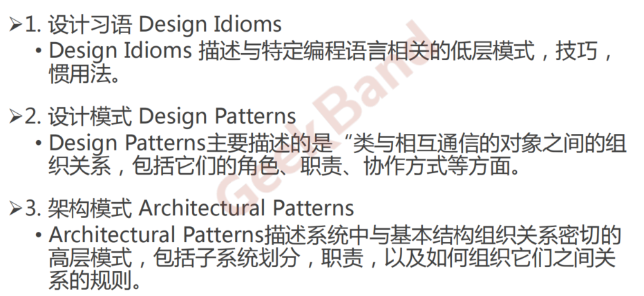