<!--
 * @Author: gl401387338@gmail.com gl5644838
 * @Date: 2023-07-30 09:11:32
 * @LastEditors: gl401387338@gmail.com gl5644838
 * @LastEditTime: 2023-07-30 10:10:09
 * @FilePath: \designMode\learningNotes\3.TemplateMethod-模板方法模式.md
 * @Description: 
 * 
 * Copyright (c) 2023 by 毛利的野望, All Rights Reserved. 
-->
## Template Method

### 1.GoF-23 模式分类
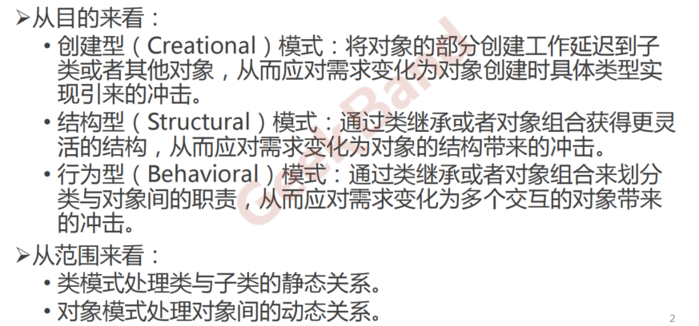
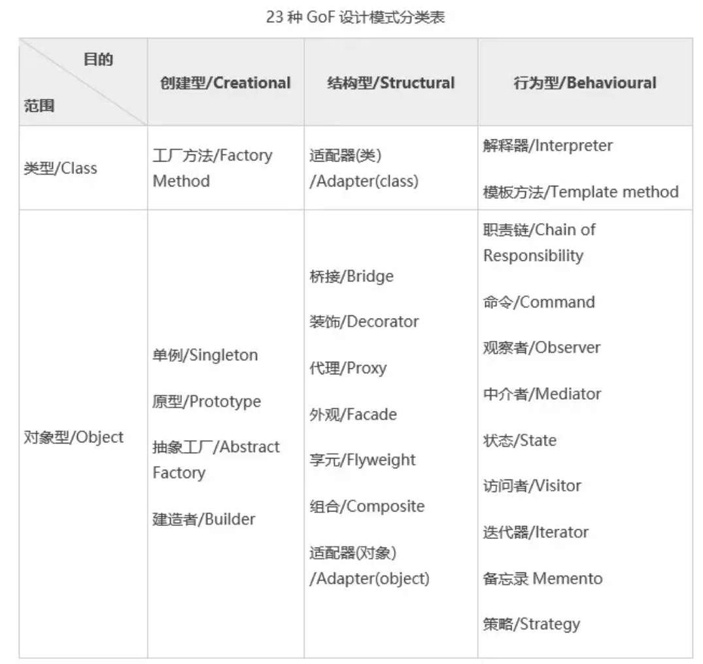

### 2.从封装变化角度对模式分类

### 3.重构获得模式 Refactoring to Patterns
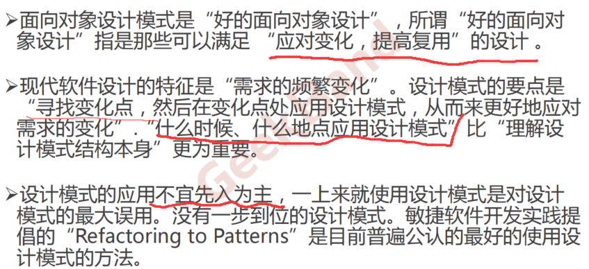

### 4.推荐图书
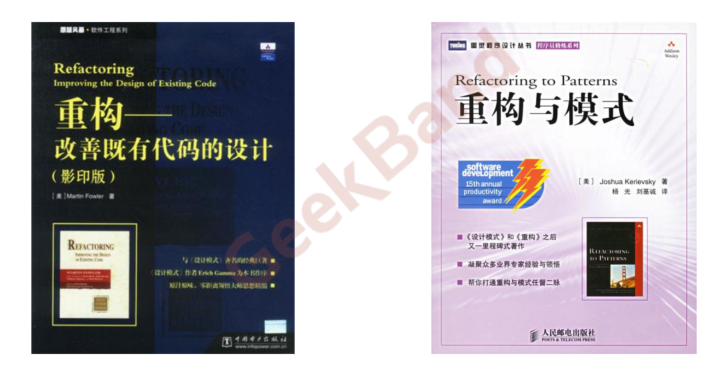

### 5.重构关键技法
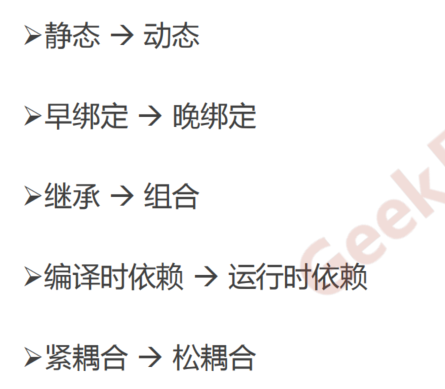

### 6.“组合协作”模式
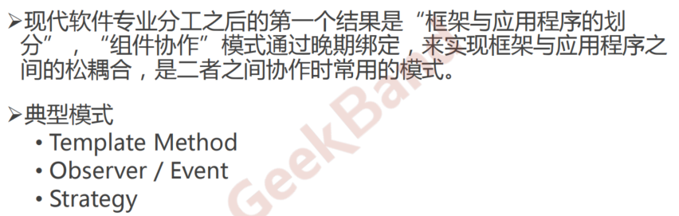

## Template Method 模式

## 1.动机（Motivation）
<u>模板方法模式：整体结构稳定。但是子步骤变化，或者晚期实现需求。（例如==打工人的一天==：一天中的整体结构，或者说流程稳定，比如早上起床-》吃饭-》去公司-》卷一上午-》吃午饭-》卷一下午-》吃晚饭-》卷一晚上-》吃夜宵-》回家-》睡觉。==其中==一天的结构是固定的，但是吃早中晚夜等饭的子步骤是变化的，比如我今天早上吃包子，中午吃面等等。所以如果要针对这种需求，将其抽象出来，实现代码的话，可以采用Template Method模式，==具体==：首先定义一个《打工人类》，其中有一个《一天生活》的函数，在该函数中，会调用一套稳定的子步骤，如《起床》《吃早餐》《上班》等等，这时其中需要变化的子步骤函数可以定义为虚函数，再定义一个子类《今天的打工人》重写这些需要变化的虚函数，从而实现每天吃不同饭的这种模式。）</u>

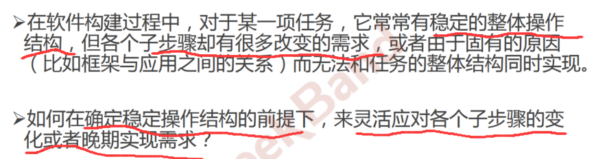

### 2.结构化软件设计流程
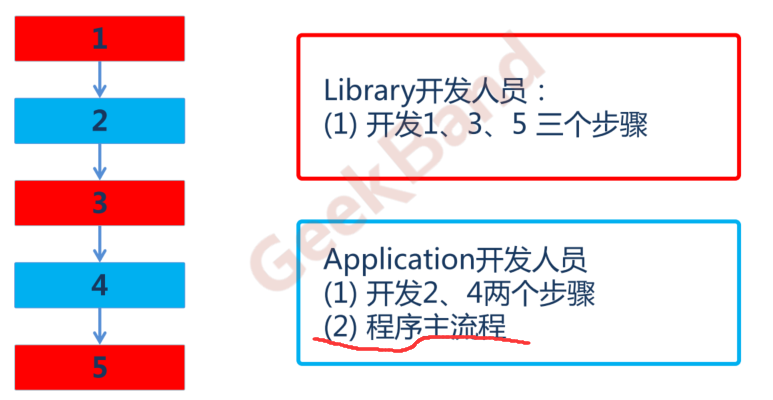

### 3.面向对象软件设计流程
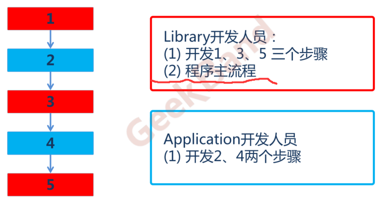

### 4.早绑定与晚绑定
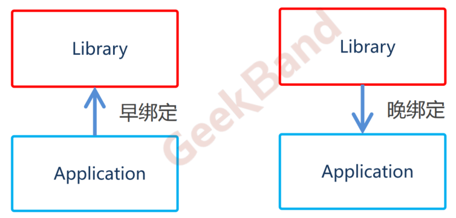

### 5.模式定义
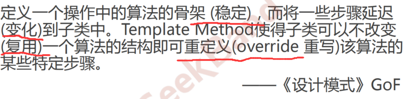

### 6.结构（Structure）
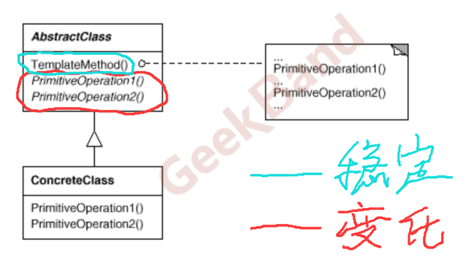

### 7.要点总结
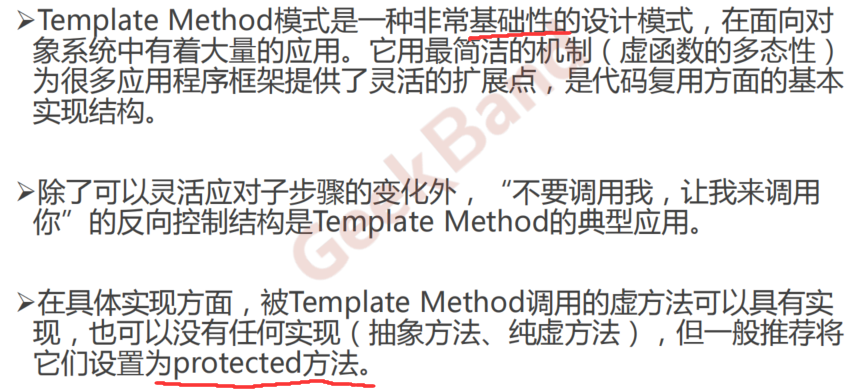

