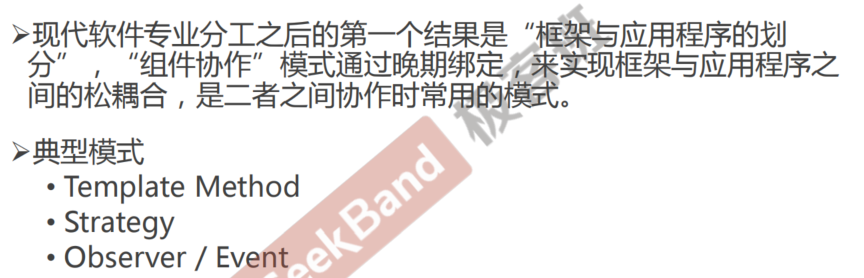
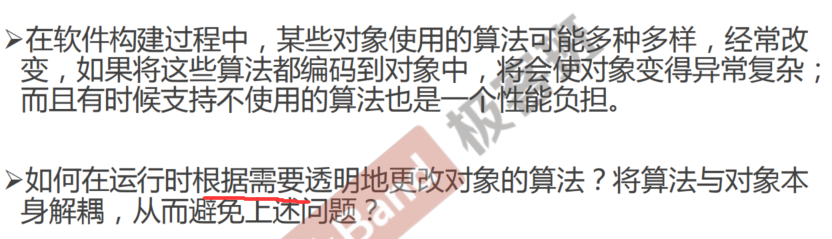
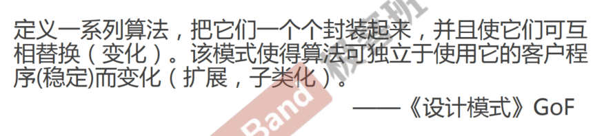
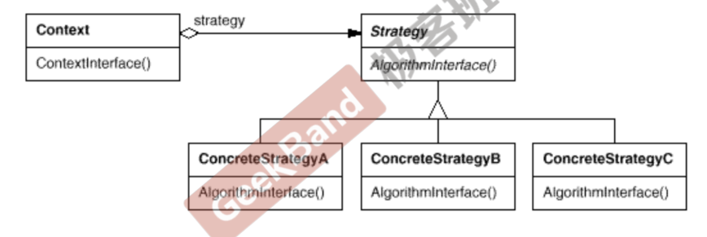
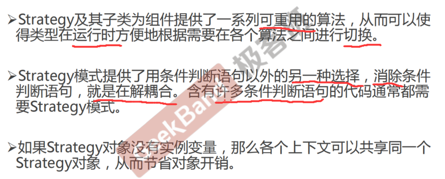

<!--
 * @Author: gl401387338@gmail.com gl5644838
 * @Date: 2023-08-05 15:19:23
 * @LastEditors: gl401387338@gmail.com gl5644838
 * @LastEditTime: 2023-08-05 15:39:47
 * @FilePath: \designMode\learningNotes\4.Strategy-策略模式.md
 * @Description: 
 * 
 * Copyright (c) 2023 by 毛利的野望, All Rights Reserved. 
-->
## Strategy 

### 1."组件协作"模式

### 2.动机 Motivation
<u>==策略模式==是一种行为型设计模式，它主要针对场景中需要变化的算法，通过运行时绑定的策略，来达到灵活使用的目的。==它和组合模式==很像，都是方法多变、需要被替换，但是组合模式是一种结构型模式，它更关注一个稳定的结构中，存在的需要变化的部分算法，而策略模式更关注将客户端与方法叉开，隔离经常变化的方法，并采用一种运行时绑定替换的策略来让客户端灵活使用算法</u>

### ==3.模式定义==

### 4.结构 Structure

### 5.要点总结

