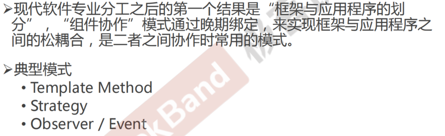
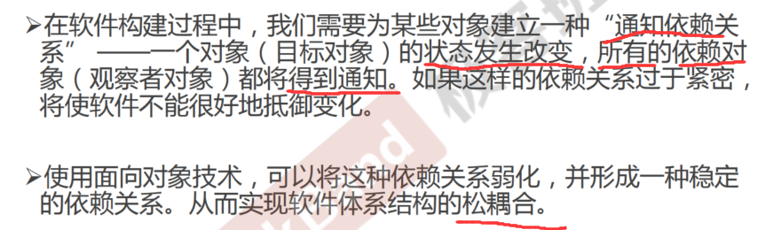
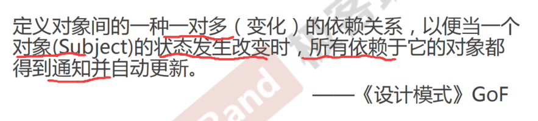
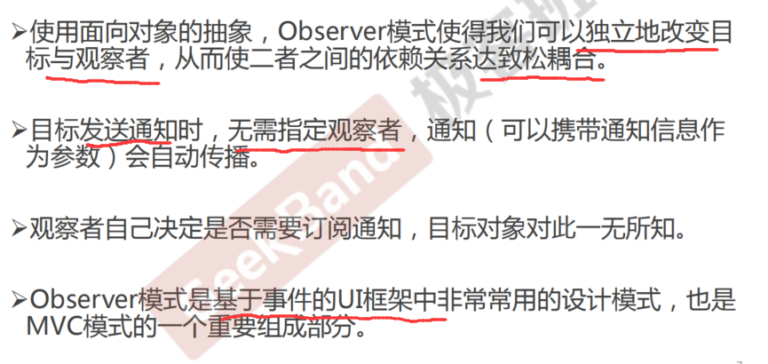

<!--
 * @Author: gl401387338@gmail.com gl5644838
 * @Date: 2023-08-05 17:43:00
 * @LastEditors: gl401387338@gmail.com gl5644838
 * @LastEditTime: 2023-08-19 16:02:05
 * @FilePath: \designMode\learningNotes\5.Observer-观察者模式.md
 * @Description: 
 * 
 * Copyright (c) 2023 by 毛利的野望, All Rights Reserved. 
-->

## Observer 观察者模式
<u>c++中的多继承少用，但有一种多继承建议使用，就是先继承一个主类，然后后面的都是接口类这种，然后可以对接口类中的函数进行实现
例如：class MainForm : public Form, public IProgress(抽象接口),...(多继承)</u>
### 1."组件协作"模式

### 2.动机（Motivation）

### 3.模式定义

### 4.结构（Structure）

### 5.要点总结

