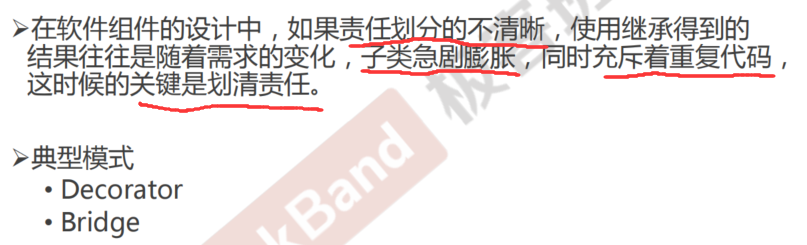
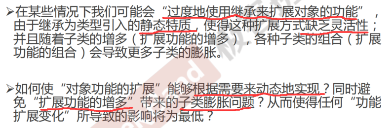
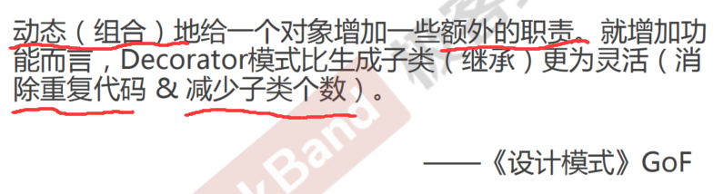
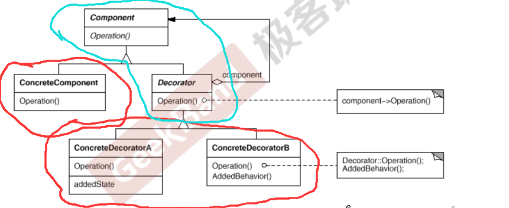
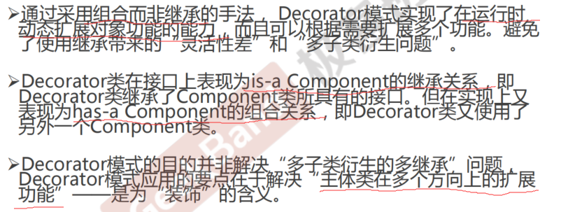

<!--
 * @Author: gl401387338@gmail.com gl5644838
 * @Date: 2023-08-19 17:16:37
 * @LastEditors: gl401387338@gmail.com gl5644838
 * @LastEditTime: 2023-08-26 11:21:22
 * @FilePath: \designMode\learningNotes\6.Decorator-装饰模式.md
 * @Description: 
 * 
 * Copyright (c) 2023 by 毛利的野望, All Rights Reserved. 
-->

## Decorator 装饰器模式

### 1."单一职责"模式

### 2.动机（Motivation）

### 3.模式定义

### 4.结构（Structure）

### 5.要点总结
