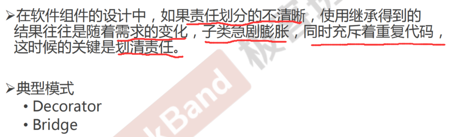
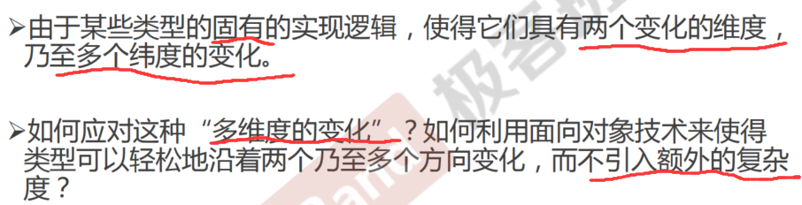
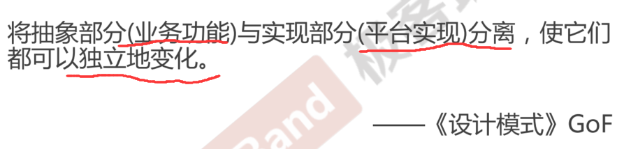
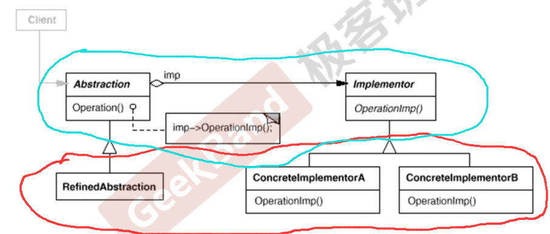
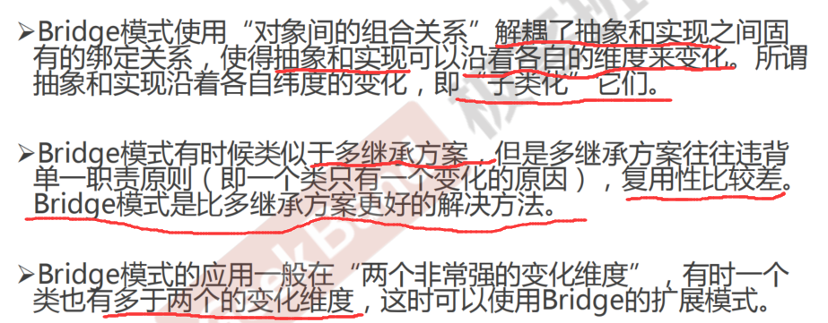

<!--
 * @Author: gl401387338@gmail.com gl5644838
 * @Date: 2023-08-27 10:50:15
 * @LastEditors: gl401387338@gmail.com gl5644838
 * @LastEditTime: 2023-08-27 11:06:01
 * @FilePath: \designMode\learningNotes\7.Bridge-桥模式.md
 * @Description: 
 * 
 * Copyright (c) 2023 by 毛利的野望, All Rights Reserved. 
-->
## Bridge 桥模式
<u>桥模式和装饰器模式很像！区别在于，装饰器模式不存在两个变化维度，而桥模式有n个变化维度，所以要把每个变化维度拆开，然后选定一个基准类，其他变换方向通过以与基准类组合，并运行时绑定的方式，来实现所有的变化！</u>

### 1."单一职责"模式：

### 2.动机（Motivation）

### 3.模式定义

### 4.结构（Structure）

### 5.要点总结

